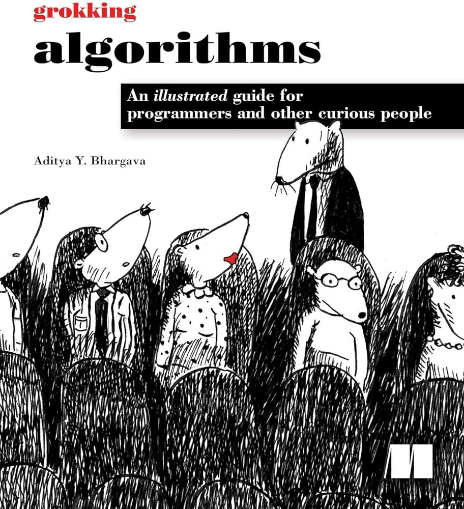

# Grokking Algorithms: Python to JavaScript

This repository contains implementations of the algorithms from the book "Grokking Algorithms" by Aditya Bhargava, translated from Python to JavaScript. Each chapter that includes code examples is covered with a brief explanation and a link to the corresponding JavaScript code.

## Table of Actually Contents

- [Chapter 2: Binary Search](#chapter-2-binary-search)
- [Chapter 3: Selection Sort](#chapter-3-selection-sort)
- [Chapter 4: Recursion](#chapter-4-recursion)
- [Chapter 5: Quicksort](#chapter-5-quicksort)
- [Chapter 6: Hash Tables](#chapter-6-hash-tables)
- [Chapter 7: Breadth-First Search](#chapter-7-breadth-first-search)

## Chapter 2: Binary Search

Binary search is an efficient technique for finding an item in a sorted list, halving the number of elements to check at each step.

**JavaScript Code:** [Binary Search](https://github.com/ElJohnnie/grokking_algorithms/blob/master/binarySearch.js)

## Chapter 3: Selection Sort

This chapter covers selection sort, a simple sorting algorithm that works by repeatedly selecting the smallest element from the unsorted portion and moving it to the sorted portion.

**JavaScript Code:** [Selection Sort](https://github.com/ElJohnnie/grokking_algorithms/blob/master/selectionSort.js)

## Chapter 4: Recursion

Recursion is a fundamental concept in computer science, where a function calls itself to solve subproblems.

**JavaScript Code:** [Recursion](https://github.com/ElJohnnie/grokking_algorithms/blob/master/recursivity.js)

## Chapter 5: Quicksort

This chapter introduces the quicksort algorithm, one of the most efficient sorting algorithms in practice.

**JavaScript Code:** [Quicksort](https://github.com/ElJohnnie/grokking_algorithms/blob/master/quickSort.js)

## Chapter 6: Hash Tables

Hash tables are efficient data structures for storing key-value pairs, allowing for quick insertions, deletions, and lookups.

**JavaScript Code:** [Hash Tables](https://github.com/ElJohnnie/grokking_algorithms/blob/master/hashTable.js)

## Chapter 7: Breadth-First Search

Breadth-First Search (BFS) is an algorithm for traversing or searching tree or graph data structures. It explores all nodes at the present depth level before moving on to nodes at the next depth level.

**JavaScript Code:** [Breadth-First Search](https://github.com/ElJohnnie/grokking_algorithms/blob/master/breadhtFirstSearch.js)

---

## License

This project is licensed under the MIT License - see the [LICENSE](LICENSE) file for details.
